# 🐧 Full Enterprise Linux Environment Deployment for Company

Welcome to a complete simulation of deploying and managing a secure Linux infrastructure for a mid-sized enterprise. This project was developed as part of the System Administration track and aims to automate, secure, and validate every step using real-world best practices.

> 👨‍💻 **Author:** Mahmoud Hamed  
> 🎓 **Supervised by:** ENG. Sondos Alsafy  
> 📄 **Track:** ITI – System Administration  
> 📁 **OS Used:** Rocky Linux  

---

## 🔍 Project Overview

This project automates the setup and management of an internal Linux environment using Bash scripting. It includes:

- 👥 Group-based access and user creation
- 🔐 File permissions and ACLs
- 💽 LVM and disk quota configuration
- 🧰 Apache Web Server setup
- 🔒 Security hardening (sudo, SSH, SELinux, firewalld)
- 📜 Automation (cron, at)
- 🧾 Troubleshooting using logs

---

## 📂 Repository Structure
linux-enterprise-project/ \
├── enterprise_setup_scripts/ # All Bash scripts per phase \
├── linux_task_output/ # Screenshots organized by task \
├── Enterprise_Linux_Deployment_Report.pdf \
├── Enterprise_Deployment_Checklist.pdf \
└── README.md 

---

## 📑 Project Phases & Features

### ⚙️ Phase 1: System Preparation & User Environment

- Hostname set to `intranet.technova.local`  
- Static IP: `192.168.153.10/24`  
- User groups: `dev_team`, `hr_team`, `it_team`, `sales_team`  
- Users assigned with secure passwords  
- Force password change on first login  

🖼️ *Screenshot Placeholder:*  
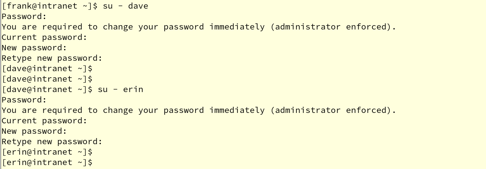  
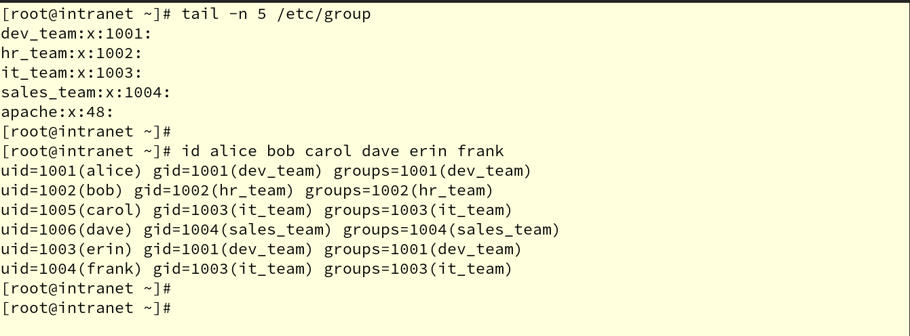  
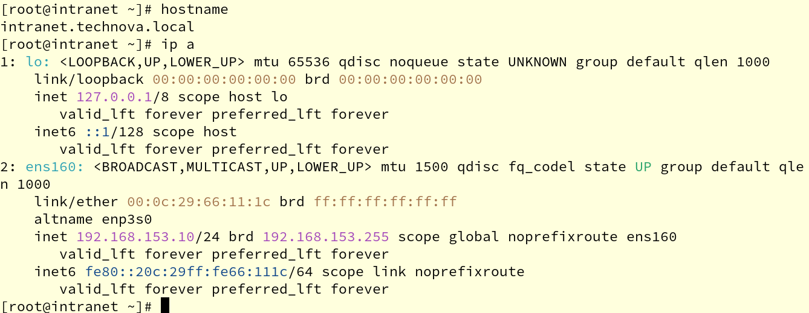

---

### 🗂️ Phase 2: Directory & Permission Setup

- Created shared folders in `/srv`  
- Set ownership and group permissions (`chmod 2770`)  
- Applied ACLs:  
  - `frank`: full access  
  - `bob`: read-only to sales  
- Set sticky bit on `/srv/public_temp`  

🖼️ *Screenshot Placeholder:*  
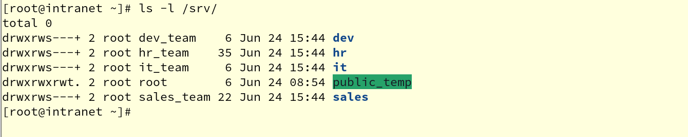  
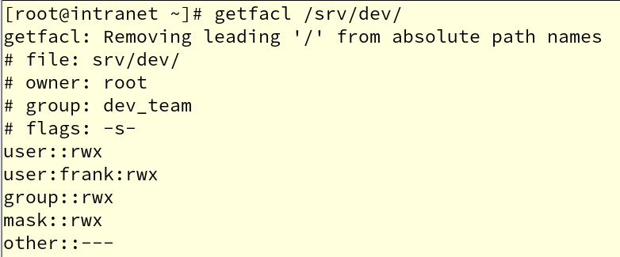  
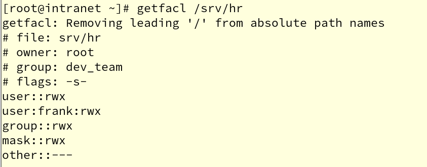  
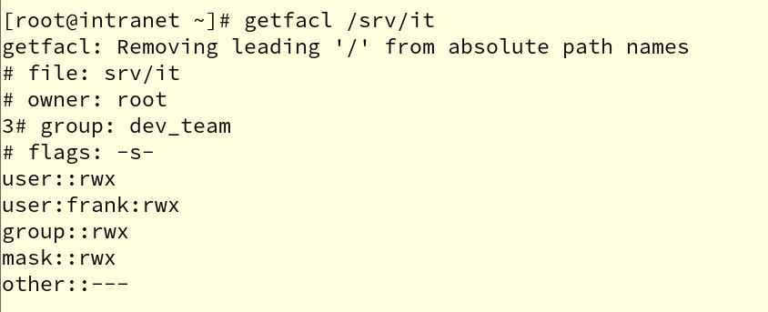  
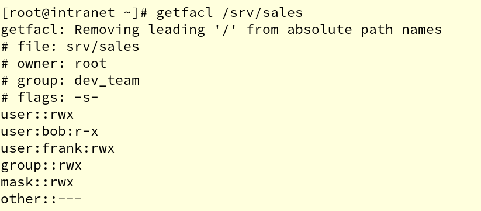

---

### 💾 Phase 3: LVM & Disk Quotas

- Created PV → VG → 4 LVs using `/dev/sda`  
- Mounted LVs to `/srv/DEPT`  
- Formatted with XFS and added to `/etc/fstab`  
- Applied disk quotas (100 MB soft / 150 MB hard) to HR & Sales  

🖼️ *Screenshot Placeholder:*  
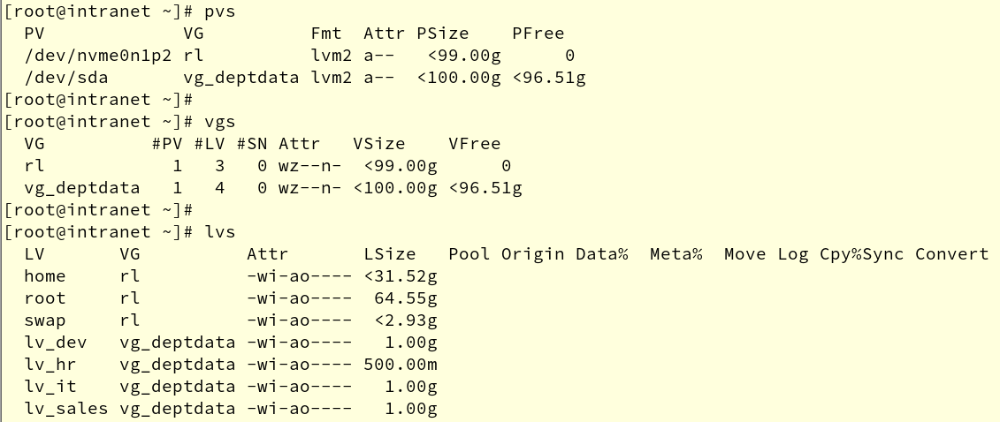  
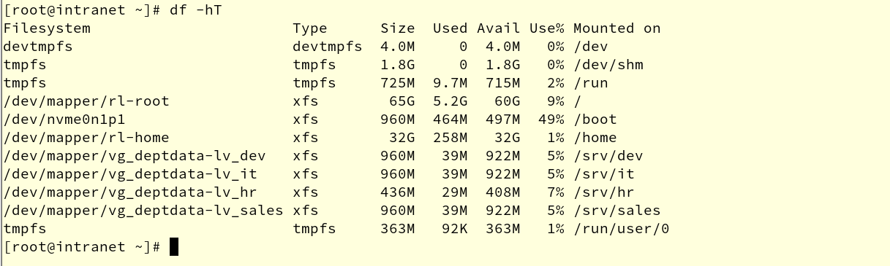  
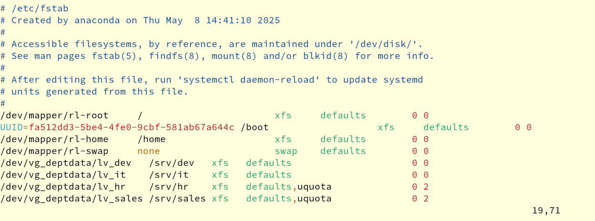  
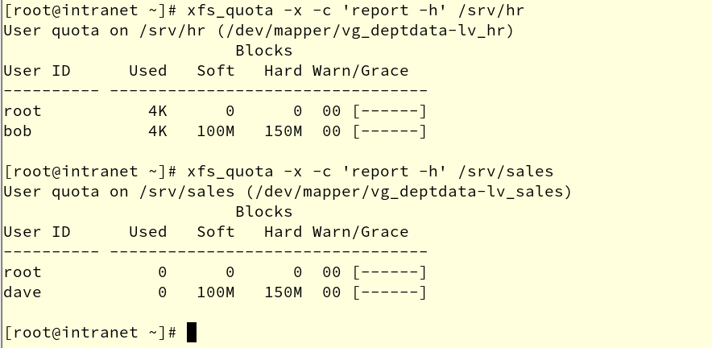

---

### 🛡️ Phase 4: Security Hardening

- `frank`: sudo access via `/etc/sudoers.d/frank`  
- SSH:  
  - Allowed only `it_team`  
  - Disabled root login  
  - Configured key-based auth for `frank`  
- SELinux: Enforced with Apache context  
- FirewallD: Allowed `SSH`, `HTTP`, and `ping`  

🖼️ *Screenshot Placeholder:*  
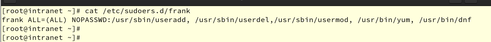  
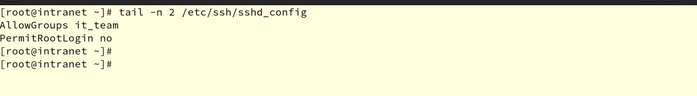  
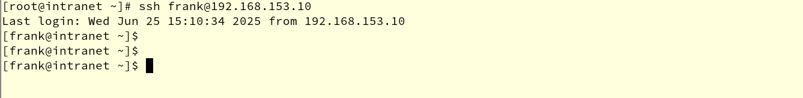  
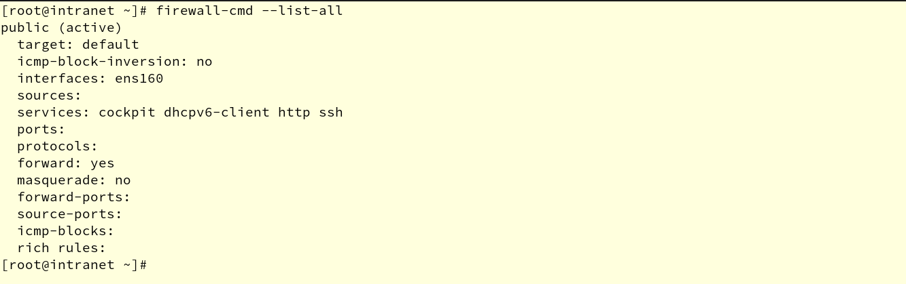

---

### 🌐 Phase 5: Apache Web Server Setup

- Installed and enabled Apache (`httpd`)  
- Served a static HTML page  
- Applied correct SELinux contexts  
- Verified from browser: [http://192.168.100.10]  

🖼️ *Screenshot Placeholder:*  
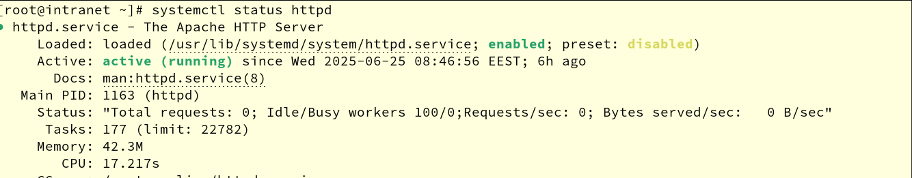  
  
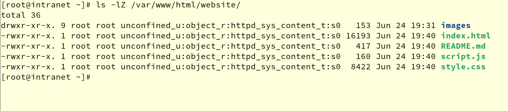  
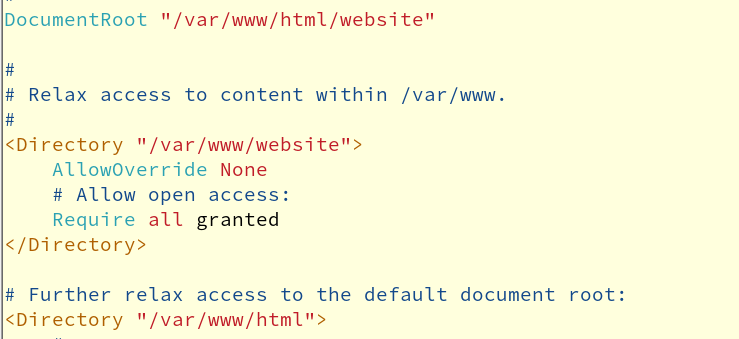  

---

### 🤖 Phase 6: Automation & Scripting

- `backup_dept.sh` runs daily at 1:00 AM (via cron)  
- Logs success/failure with `logger`  
- `at` job broadcasts save reminder at 17:00  

🖼️ *Screenshot Placeholder:*  
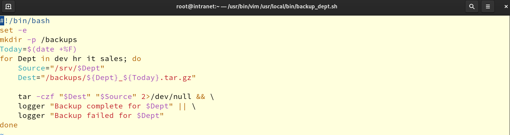  
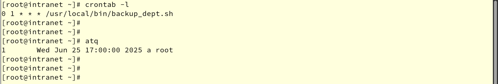  
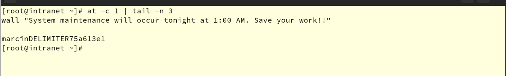

---

### 🛠️ Phase 7: Troubleshooting & Logs

- Simulated `/etc/fstab` error → fixed in recovery mode  
- Checked `/var/log/secure` for SSH login attempts  
- Verified backup logs in `/var/log/messages`  

🖼️ *Screenshot Placeholder:*  
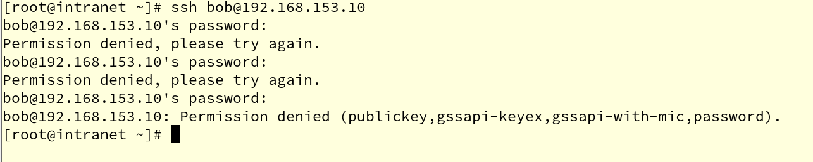  
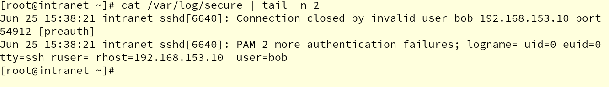  
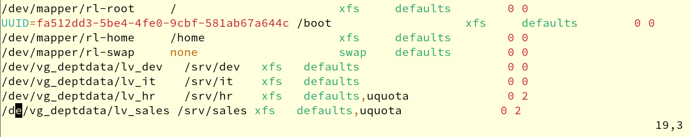  
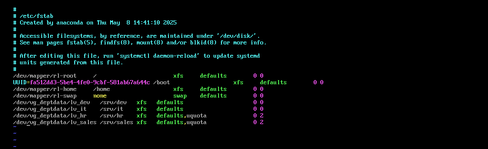  
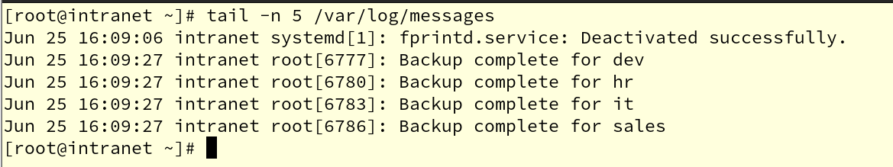

---

## 📸 Screenshots Folder Convention

All screenshots are organized under `linux_task_output/`, with a subfolder per task.  
linux_task_output/ \
├── task1_Sys_Prep/ \
├── task2_Dir_Perm_setup/ \
├── task3_Storage_LVM_setup/ \
├── task4_Sec_Hardening/ \
├── task5_Web_portal/ \
├── task6_Cron_Logs/ \
└── task7_troubleshooting/ \
[Linux](https://github.com/search?q=Linux)
[System Administration](https://github.com/search?q=System+Administration)
[Bash Scripting](https://github.com/search?q=Bash+Scripting)
[Security](https://github.com/search?q=Security)
[LVM](https://github.com/search?q=LVM)
[DNS](https://github.com/search?q=DNS)
[Apache](https://github.com/search?q=Apache)
[SELinux](https://github.com/search?q=SELinux)
[Rocky Linux](https://github.com/search?q=Rocky+Linux)
[Automation](https://github.com/search?q=Automation)
